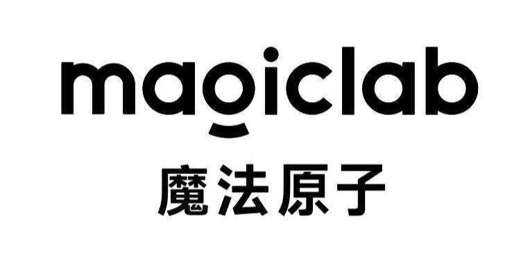

  

 

<a href="https://www.magiclab.top/"> Magiclab Robotics </a> is dedicated to the development, production, and commercialization of high-performance quadruped and humanoid robots for both consumer and industrial applications. With strong emphasis on independent innovation, we strive to push the boundaries of robotics by advancing key technologies such as structural design, motion control, and intelligent perception.

 

<table><tbody>
<table class="table table-striped table-bordered table-vcenter"/>
    <tbody>
    <tr><th> Title </th> <th>Description</th> <th>Stars</th> <th>Forks</th></tr>
    <tr>
        <td colspan="1" rowspan="2" align="center" class="ai-notebooks-table-points ai-orange-link">
            magiclab_model
        </td>
        <td><a href="https://github.com/MagiclabRobotics/magicbot-gen1_description" target="_blank"> magicbot-gen1_description </a>   Robot 3D model for Magicbot-Gen1(URDF & MJCF). </td>
        <td></td>
        <td></td>
    </tr>
    <tr>
        <td><a href="https://github.com/MagiclabRobotics/magicdog_description" target="_blank"> magicdog_description </a>   Robot 3D model for MagicDog(URDF). </td>
        <td></td>
        <td></td>
    </tr>
    <tr>
        <td colspan="1" rowspan="3" align="center" class="ai-notebooks-table-points ai-orange-link">
        robot_sdk
        </td>
        <td><a href="https://github.com/MagiclabRobotics/magicbot-gen1_sdk" target="_blank"> magicbot-gen1_sdk </a>   SDK for secondary development with Magicbot-Gen1. </td>
        <td></td>
        <td></td>
    </tr>
    <tr>
        <td><a href="https://github.com/MagiclabRobotics/magicdog_ros2_sdk" target="_blank"> magicdog_ros2_sdk </a>   ROS2 sdk for secondary development with MagicDog, providing interfaces of several devices with ros2 topic and service. Slam and navigation are also integrated.</td>
        <td></td>
        <td></td>
    </tr>
        <tr>
        <td><a href="https://github.com/MagiclabRobotics/magicdog_motion_sdk" target="_blank"> magicdog_motion_sdk </a>   Pure motion sdk for secondary development with MagicDog, providing both low level and high level controllers. </td>
        <td></td>
        <td></td>
    </tr>
<tr>
        <td colspan="1" rowspan="2" align="center" class="ai-notebooks-table-points ai-orange-link">
            manipulation
        </td>
        <td><a href="https://github.com/MagiclabRobotics/pico_teleoperate" target="_blank"> pico_teleoperate </a>   Use PICO4 Ultra to teleoperate Magicbot-Gen1. </td>
        <td></td>
        <td></td>
    </tr>
    <tr>
        <td><a href="https://github.com/MagiclabRobotics/magicbot-gen1_moveit_config" target="_blank"> magicbot-gen1_moveit_config </a>   MoveIt2 configuration and interface for Magicbot-Gen1. </td>
        <td></td>
        <td></td>
    </tr>
    </tbody>
</table>
